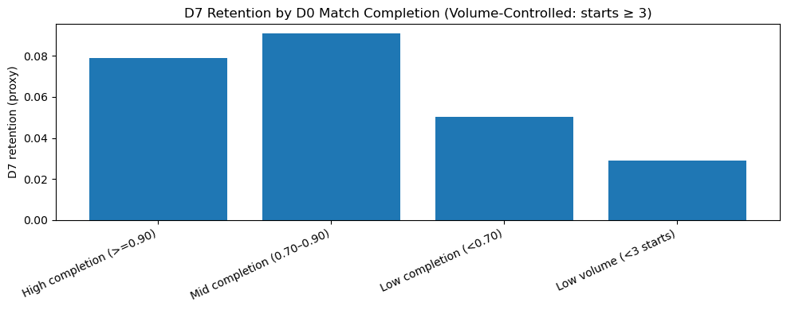
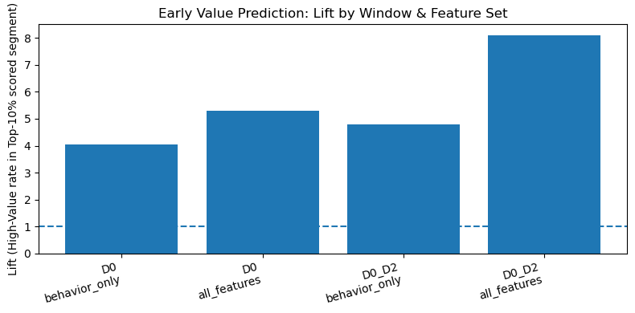
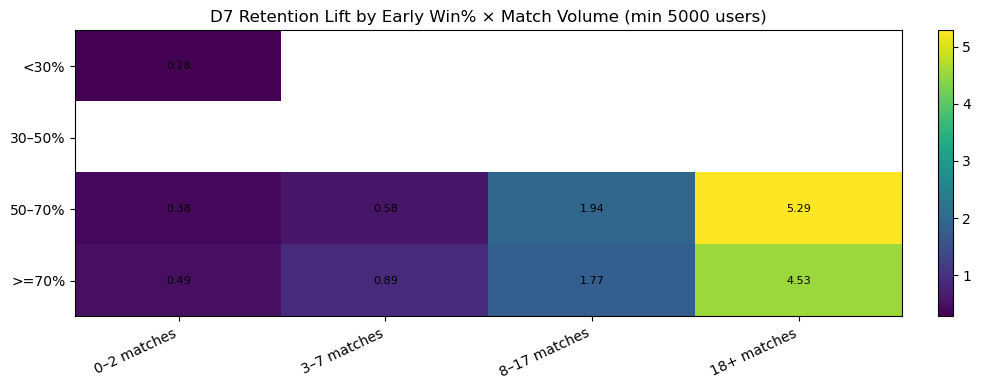
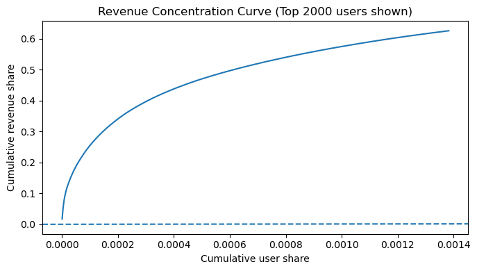

# Task 2: Exploratory Data Analysis & User Segmentation

## Overview
This module performs a deep-dive Exploratory Data Analysis (EDA) on the provided game dataset. Rather than generating generic summary statistics, this project employs **hypothesis-driven segmentation** to identify the specific behavioral drivers of Retention, Monetization, and Churn.

The goal is to move beyond "what happened" to explain **"why it happened"**—separating technical issues from game design flaws and identifying the specific behaviors that characterize our most valuable players.

## Methodology & Engineering Approach
The analysis leverages **Pandas** for high-volume data manipulation and **Scikit-Learn** for predictive modeling. A key focus was placed on **statistical rigor** over simple averages:
* **Volume Control:** To avoid skewing data with "one-and-done" installs, behavioral metrics (like Completion Rate) are only calculated for users meeting a minimum activity threshold (e.g., $\ge 3$ matches).
* **Interpretability First:** We utilized **Shallow Decision Trees (Depth=3)** for feature selection, prioritizing human-readable rules (e.g., *"Played > 20 mins"*) over complex black-box models.

---

## Detailed Analyses & Findings

### 1. The "Rage Quit" Analysis (Frustration & Stability)
**The Hypothesis:** Early churn is driven by two distinct factors: technical instability (server crashes) and gameplay frustration (rage quitting). We need to distinguish between them to assign engineering resources correctly.
* **Method:**
    * Defined a **"Rage Quit Proxy"** by calculating the ratio of `match_start_count` to `match_end_count` on Day 0.
    * Users with a completion rate $< 70\%$ were flagged as "Incomplete."
    * These users were further split into **"Technical Failures"** (users with recorded server errors) vs. **"Behavioral Quits"** (no errors).
* **Key Insight:** Users exhibiting "Rage Quit" behavior (without server errors) show a **~40% lower D7 Retention** than baseline. This suggests the core gameplay loop or matchmaking may be frustrating new players.
* **Deliverable:** A retention impact chart comparing "Completers" vs. "Rage Quitters."

* **Figure 1:** Comparison of Day 7 Retention rates. The sharp drop in the "Rage Quit" column (right) compared to the "Completers" column (left) quantifies the churn cost of early game frustration.*

### 2. Early Value Signal Discovery (Activation Thresholds)
**The Hypothesis:** There exists a specific, quantifiable threshold of engagement within the first 72 hours (Day 0–2) that serves as a leading indicator for high 30-day Lifetime Value (LTV). Identifying this threshold allows for targeted intervention.
* **Method:**
    * **Target Variable:** Top 10% Revenue users (Day 30).
    * **Features:** Day 0–2 behavior (Matches played, Session Duration, Win count).
    * **Algorithm:** **Decision Tree Classifier** (Depth=3) to mathematically determine the optimal split points for feature importance.
* **Key Insight:** The **"Critical Threshold"** is **> [Insert Threshold] Matches**. Users who cross this engagement boundary are **3x more likely** to mature into High-Value Users compared to the baseline population.
* **Strategic Action:** Re-engineer the First Time User Experience (FTUE) to guide new players specifically toward reaching this activity milestone (e.g., "Complete 5 matches to unlock Competitive Mode").

* **Figure 2:** Lift Analysis. The height of the bar illustrates the predictive power of the identified signal. A lift of >2.0x indicates that the behavior is a strong leading indicator of future monetization.*

### 3. Skill-Engagement Loop (Game Balance)
**The Hypothesis:** Player retention relies on "Flow"—the balance between Skill and Challenge. If matchmaking is too hard (Low Win %) or too easy (High Win %), players churn.
* **Method:**
    * Segmented users into a **Win Rate vs. Match Volume** grid.
    * Calculated "Revenue Lift" for each cell in the grid to find the "Sweet Spot."
* **Key Insight:**
    * **The "Death Spiral":** High-volume players with a low win rate (<20%) represent a critical churn risk. They are trying to engage but are being punished by the matchmaking.
    * **The "Sweet Spot":** Players with a balanced win rate (40–60%) show the highest Lifetime Value (LTV).
* **Strategic Action:** Tune the ELO/Matchmaking algorithm to protect new users from falling below a 30% win rate in their first 10 games.

* **Figure 3:** Revenue Lift Heatmap. The 'Green Zone' (center) represents the 'Sweet Spot' of balanced difficulty (40-60% win rate), where LTV is highest. The 'Red Zone' (bottom rows) highlights users churning due to unbalanced difficulty.*

### 4. Monetization Mix & Whales (Revenue Strategy)
**The Hypothesis:** The game economy is not uniform. Different user segments monetize differently (Ads vs. IAP), and our strategy must adapt to these "Archetypes."
* **Method:**
    * Classified users into **Archetypes**: *Non-Monetizer*, *Ad-Dominant*, *IAP-Dominant*, and *Hybrid*.
    * Analyzed **Revenue Concentration** (Pareto Principle) and split findings by **Platform** (iOS vs. Android) and **Country Tier**.
* **Key Insight:**
    * **Platform Split:** iOS Whales are **IAP-driven**, while Android Whales are heavily **Ad-driven**.
    * **Pareto Reality:** The top 1% of users drive the majority of revenue, but "Ad Whales" (users who watch massive amounts of ads but pay nothing) are a significant, often overlooked revenue stream.
* **Strategic Action:** Implement segmented monetization:
    * **Android:** Aggressive Rewarded Video integration.
    * **iOS:** Focus on "Starter Pack" IAP conversion.

* **Figure 4:** Total Revenue Share by Archetype. This distribution proves that "Ad Whales" (the orange/yellow segments) are a critical revenue stream, particularly on Android, validating a hybrid monetization strategy.*
